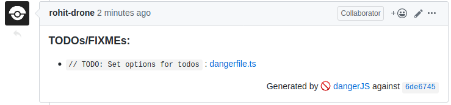
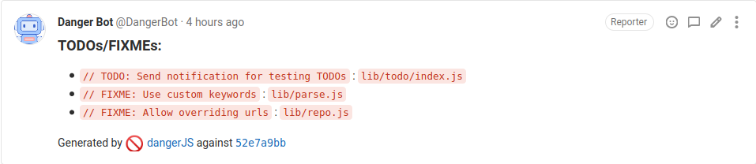
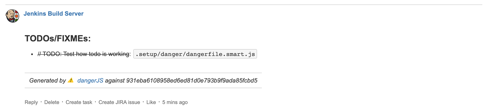

# danger-plugin-todos

[](https://github.com/rohit-gohri/danger-plugin-todos/actions?query=branch%3Amaster)
[](https://www.npmjs.com/package/danger-plugin-todos)
[](https://www.npmjs.com/package/danger-plugin-todos)
[](https://github.com/semantic-release/semantic-release)
[](https://github.com/rohit-gohri/danger-plugin-todos/blob/master/LICENSE.md)

A [danger-js](https://danger.systems/js/) plugin to list all todos/fixmes/etc added/changed/removed in a PR.

## Intro to Danger

Danger is a tool to automate common code review practices. It can run as part of your CI pipeline and help maintain standards. Check out their github repo at [danger/danger-js](https://github.com/danger/danger-js). You can configure it using a `dangerfile`, which is a javscript or typescript file in the root of your project. It'll post it's results as a comment in the PRs of your project.

## Usage

To use you must already have `danger-js` set up in your repo. 

### Install

```sh
yarn add danger-plugin-todos --dev
# OR
npm i --save-dev danger-plugin-todos
```

### At a glance

```js
// dangerfile.js
import { schedule } from 'danger'
import todos from 'danger-plugin-todos'

// Using schedule because this is an async task
schedule(todos())


// Optionally provide options
schedule(todos({
    ignore: ['CHANGELOG.md', /test/], // Any files to ignore, can be part of filename or regex pattern to match (default: [])
    keywords: ['TODO', 'FIXME', 'TO-DO'], // Keywords to find (default: ['TODO', 'FIXME'])
    repoUrl: 'https://github.com/rohit-gohri/danger-plugin-todos', // If using github provide the repo url (default: true - tries to pick from package.json -> repository.url)
}))


// For other git providers (that don't follow github style links for files) provide a custom function to turn filepaths into links for the specific commit
schedule(todos({
    repoUrl: (filepath) => `https://custom-git-example.com/rohit-gohri/danger-plugin-todos/tree/${danger.git.commits[0].sha}/${filepath}`,
}))

schedule(todos({
    repoUrl: false, // for using simple filepaths without links
}))
```

### Results Preview

#### Github



#### Gitlab



#### Bitbucket

This is an example for #4



## Changelog

See the GitHub [release history](https://github.com/rohit-gohri/danger-plugin-todos/releases).

## Contributing

See [CONTRIBUTING.md](CONTRIBUTING.md).
